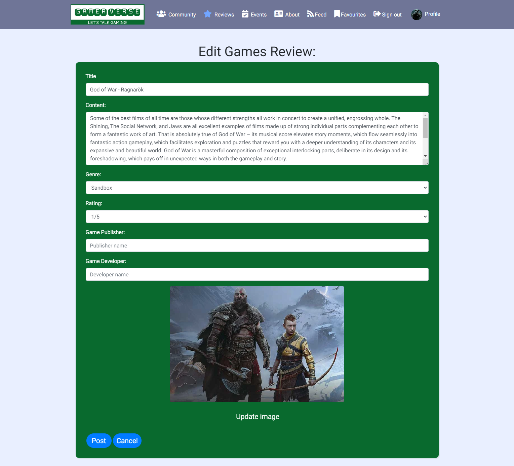
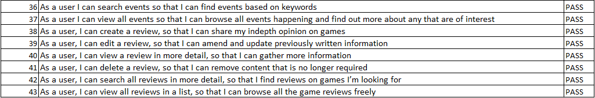

# PP5 - Advanced Frontend  - Gamer Verse

## Introduction
Gamer Verse is a content-sharing platform to share reviews, posts and have social interactions with like-minded individuals about games. Users will be able to find posts and reviews relating to the gaming space, along with community events in local cities. This is the frontend section of the project built to work in conjunction with the backend DRF API as the database.

DEPLOYED FRONTEND (HEROKU) - [CLICK HERE](https://gamer-verse.herokuapp.com/)

DEPLOYED API (HEROKU) - [CLICK HERE](https://gamer-verse-drf-api.herokuapp.com/)

DEPLOYED BACKEND REPOSITORY - [CLICK HERE](https://github.com/Jbachtiger/ci-pp5-gamer-verse-drf-api)


## Table of Contents
- [User Experience (UX)](#user-experience)
    - [Site Purpose](#site-purpose)
    - [Site Goals](#site-goals)
    - [Epics](#epics)
    - [User Stories](#user-stories)
- [Design](#design)
    - [Wireframes](#wireframes)
    - [Colour Scheme](#color-scheme)
    - [Fonts](#fonts)
- [Agile](#agile)
- [Features](#features)
- [Future Development](#future-development)
- [Components](#components)
- [Testing](#testing)
    - [Manual Testing](#manual-testing)
    - [Automated Testing](#automated-testing)
    - [Browser and Device Testing](#browser-and-device-testing)
    - [W3C Validator](#w3c-validatior)
    - [JS Lint](#js-lint)
    - [PEP8 Linter Results](#pep8-linter-results)
    - [Colour Contrast Checks](#colour-contrast-checks)
    - [Lighthouse Tool](#lighthouse-tool)
- [Solved Bugs](#solved-bugs)
- [Known Bugs](#known-bugs)
- [Technologies Used](#technologies-used)
    - [Languages Used](#languages-used)
    - [Frameworks, Libraries and Programs](#frameworks-libraries-and-programs)
    - [Databases](#databases)
- [Deployment](#deployment)
    - [Deploying to Heroku](#deploying-to-heroku)
    - [Forking Repository](#forking-repository)
    - [Cloning Repository](#cloning-repository)
- [Credits](#credits)
    - [Code](#code)
    - [Content](#content)
    - [Media](#media)
    - [Resources](#resources)
    - [Acknowledgements](#acknowledgements)


## User Experience
### Site Purpose
To be the go-to gaming community by sharing the latest news, reviews, and interesting gaming trivia that users can then comment on and have a friendly discussion to share their passion. 

### Site Goals
- To provide users with the latest news, reviews, and trivia about gaming
- To bring people together and create a sense of belonging
- To share with the community and create interesting discussions
- To share local events

__Sites Ideal Users__
- An interest in gaming no matter what medium
- Looking for a gaming community to reach out and connect with like-minded individuals


### Epics
8 Epics were created which were further developed into 34 User Stories. The details of each epic along with the associated user stories can be found on the kanban board [here](https://github.com/users/Jbachtiger/projects/3). 

1. Initial Django REST and React Setup [#1](https://github.com/Jbachtiger/ci-pp5-gamer-verse/issues/1)
2. Authentication [#2](https://github.com/Jbachtiger/ci-pp5-gamer-verse/issues/2)
3. Navigation [#3](https://github.com/Jbachtiger/ci-pp5-gamer-verse/issues/3)
4. Posts [#4](https://github.com/Jbachtiger/ci-pp5-gamer-verse/issues/4)
5. Comments [#5](https://github.com/Jbachtiger/ci-pp5-gamer-verse/issues/5)
6. Profiles [#6](https://github.com/Jbachtiger/ci-pp5-gamer-verse/issues/6)
7. Events [#7](https://github.com/Jbachtiger/ci-pp5-gamer-verse/issues/7)
8. Reviews [#38](https://github.com/Jbachtiger/ci-pp5-gamer-verse/issues/38)

### User Stories 
Below are links to each of the individual user stories that were completed within the project's initial release.

1. Initial Django REST and React Setup
    - Install Django REST and supporting libraries for backend API [#8](https://github.com/Jbachtiger/ci-pp5-gamer-verse/issues/8)
    - Install REACT and supporting libraries for frontend [#9](https://github.com/Jbachtiger/ci-pp5-gamer-verse/issues/9)
    - Keep secret keys secure [#10](https://github.com/Jbachtiger/ci-pp5-gamer-verse/issues/10)
    - Early deployment of the site to Heroku [#11](https://github.com/Jbachtiger/ci-pp5-gamer-verse/issues/11)

2. Authentication
    - Register for an account [#12](https://github.com/Jbachtiger/ci-pp5-gamer-verse/issues/12)]
    - Sign in with your account [#13](https://github.com/Jbachtiger/ci-pp5-gamer-verse/issues/13)]
    - Logged in/out user status [#14](https://github.com/Jbachtiger/ci-pp5-gamer-verse/issues/14)
    - Sign out [#15](https://github.com/Jbachtiger/ci-pp5-gamer-verse/issues/15)
    - Access tokens [#16](https://github.com/Jbachtiger/ci-pp5-gamer-verse/issues/16)

3. Navigation
    - View navbar on every page [#17](https://github.com/Jbachtiger/ci-pp5-gamer-verse/issues/17) 
    - Navigate through pages without having to refresh each time [#18](https://github.com/Jbachtiger/ci-pp5-gamer-verse/issues/18)
    - Clear sign in/sign up options [#19](https://github.com/Jbachtiger/ci-pp5-gamer-verse/issues/19)
    - Infinite scroll [#20](https://github.com/Jbachtiger/ci-pp5-gamer-verse/issues/20)

4. Posts
    - Create, View, Edit and Delete Posts [#21](https://github.com/Jbachtiger/ci-pp5-gamer-verse/issues/21)
    - Like posts [#22](https://github.com/Jbachtiger/ci-pp5-gamer-verse/issues/22)
    - View a list of liked posts [#23](https://github.com/Jbachtiger/ci-pp5-gamer-verse/issues/23)
    - Search posts [#24](https://github.com/Jbachtiger/ci-pp5-gamer-verse/issues/24)
    - Follow users [#25](https://github.com/Jbachtiger/ci-pp5-gamer-verse/issues/25)

5. Comments
    - Create, Edit, View and Delete Comments [#41](https://github.com/Jbachtiger/ci-pp5-gamer-verse/issues/41)
    - View comment date [#42](https://github.com/Jbachtiger/ci-pp5-gamer-verse/issues/42)

6. Profiles
    - View profile pages [#26](https://github.com/Jbachtiger/ci-pp5-gamer-verse/issues/26)
    - See most popular profiles [#27](https://github.com/Jbachtiger/ci-pp5-gamer-verse/issues/27)
    - User statistics [#28](https://github.com/Jbachtiger/ci-pp5-gamer-verse/issues/28)
    - Follow/Unfollow a user [#29](https://github.com/Jbachtiger/ci-pp5-gamer-verse/issues/29)
    - View all posts by a specific user [#30](https://github.com/Jbachtiger/ci-pp5-gamer-verse/issues/30)
    - Edit profile [#31](https://github.com/Jbachtiger/ci-pp5-gamer-verse/issues/31)
    - Update username and password [#32](https://github.com/Jbachtiger/ci-pp5-gamer-verse/issues/32)
    - View user's avatar [#33](https://github.com/Jbachtiger/ci-pp5-gamer-verse/issues/33)
    - Set user avatar [#34](https://github.com/Jbachtiger/ci-pp5-gamer-verse/issues/34)

7. Events
    - Create, Edit, View and Delete Event [#35](https://github.com/Jbachtiger/ci-pp5-gamer-verse/issues/35)
    - Search all events [#36](https://github.com/Jbachtiger/ci-pp5-gamer-verse/issues/36)

8. Reviews
    - Create, Edit, View and Delete Reviews [#37](https://github.com/Jbachtiger/ci-pp5-gamer-verse/issues/37)
    - Search all reviews [#39](https://github.com/Jbachtiger/ci-pp5-gamer-verse/issues/39)
    - View all reviews [#40](https://github.com/Jbachtiger/ci-pp5-gamer-verse/issues/40)

## Design
### Wireframes
- About


- Events


- Forms


- Homepage


- Profile


### Color Scheme

Various colours were used throughout the website. There was the main colour scheme used with supporting colour pallets also. Below are the various pallets that were used.

Main Pallete:


Supporting Pallettes:


### Fonts
The font used in this project was Roboto with a backup of sans-serif. It was chosen for its easy readability for users. Fonts were imported using Google Fonts.

## Agile
Throughout this project, an agile approach was used to develop the website. Each activity was broken down into smaller bite-sized more manageable actions from initially creating 8 Epics, which were then broken down into 34 smaller user stories. Each of the user stories then had an acceptance criterion and a list of tasks to complete. This made the overall project much more manageable to build. GitHub labels were used to categorise the user stories using the MoSCoW Prioritisation technique. This made it easy to categorise tasks by importance, prioritise the focus on these and get the project completed.

A kanban board was created using GitHub Projects [here](https://github.com/users/Jbachtiger/projects/3/views/1) to help keep track of all the tasks including Todo, In Progress and Done.


## Features

### Homepage
A clean homepage with minimal distractions ensures the user's main focus is on the list of posts. The posts are displayed in a single list, styled as cards to give a clean separation between posts. Each post includes a title, description and category. This provides the user with a good summary of information to see if they would like to interact with the post further by clicking on it and leaving a comment on it or liking it. Users do not need to be registered to view a post but do need to be logged in to like or comment on a post. There are different features and navbars available dependent on if a user is signed in or not.

- Homepage signed in


- Homepage signed out


### Navbar
The navbar is featured on all pages, is responsive and has active links functionality so the user knows which link they are on by hovering on it in the navbar. It is identical on all pages and is easy to use providing a good user experience. For mobile view, the navbar reduces to a burger menu. The purpose of this feature is to allow users to navigate all pages easily across all devices without having to use a back button to get to the next page. There is also authentication in place which will change what displays on the navbar depending on whether a user is logged in or not.

- Logged out Navbar


- Logged in Navbar


### Sign in, Sign out and Sign up
The website has a sign up functionality which then redirects the user to sign in once submitted and then once signed in there is an option to sign out.


### Posts

- Post


- Post page with comments section signed out


- Post page with comments section signed in


- Add post form


- Edit post form


### Reviews

- Review


- Add review form


- Edit review form



### Events

- Event


- Add event form


- Edit event form


### Profiles
- Most Active Community Gamers


- Profile (signed out)


- Profile (signed in)


- Edit Profile


- Edit Username


- Edit Password


### About


## Future Development
- Like and comment ability for reviews and events pages
- Private messaging between users
- Group messaging between users
- Interactive gaming session where users can play browser games together on the website
- Gamer scoreboard
- Notifications for when a user receives a new follow, comment or like
- A contact form so users can get in touch with site admins/provide feedback

## Components
A wide selection of components have been implemented throughout this project and reused on multiple pages:

1. Asset.js - this component supplied the loading spinner used throughout the website
2. Avatar.js - this component adds to the improved UX by allowing users to add a profile image of their choice 
3. MoreDropdown.js - this allowed the user to edit and delete posts, events and reviews
4. axiosDefault.js - an efficient way to communicate with the backend Gamer Verse API
5. NavBar.js - this component is present on every page of the website. It makes navigating the website easy for the user and collapses into a hamburger menu for screen sizes medium and below
6. NotFound.js - this component appears when a user tries to access invalid URLs. There is a clear message that appears telling the user the page doesn't exist
7. CurrentUserContext.js - confirms the user logged in status so that appropriate functionality can be displayed and is available to the user such as creating a post
8. ProfileDataContext.js - provides the follow/unfollow functionality to other users across the Popular Profiles and Profile Pages components
9. useRedirect.js - redirects a user to another page if they are not authorised to be on the page they are trying to access
10. utils.js - provides the functionality to all of the components that utilise the infinite scroll

## Testing

### Manual Testing
I have manually tested all the features of the website making sure to go through them with different browsers and device sizes. I have also checked the features of the site against the original user stories to ensure they have all been actioned.

- CRUD functionality has been tested for the following: Posts, Reviews, Events, Comments, Likes, Follows and Profile on both the development and deployed version of the site
- All Nav links open on the correct page
- All external links open in a new browser
- Authentication works displaying a different set of options for logged-in users compared to logged-out
- Pages that are intended for logged-in users only will redirect any users who are not logged in back to the homepage
- Validation on forms works
- Not found pages display correctly when a non-existent URL is searched or a Post, Review or Event that doesn't exist is searched

__User Stories__




### Browser and Device Testing

__Browsers__

- The website was tested on the following browsers: Google Chrome, Firefox, Microsoft Edge and Safari
- For each browser, functionality was tested including links and the responsive design

__Devices Tested__

The website was viewed on a variety of devices of all sizes including:
- Windows 11 Desktop (screen resolutions tested in 2560x1080 and 1920x1080)
- MacBook Pro (13-inch 2015 version)
- Moto G4
- Galaxy S5
- Pixel 2
- Pixel 2 XL
- iPhone 5/SE
- iPhone 6/7/8
- iPhone 6/7/8 Plus
- iPhone X
- iPad
- iPad Pro
- Surface Duo

The website is fully responsive and no issues were found.

### W3C Validatior
The official W3C Markup Validator was used to validate the CSS in the project.

__W3C CSS Markup Validatior__ - https://jigsaw.w3.org/css-validator/validator

All CSS code passed through the validator without any issues.


### ES Lint
The ESLint extension was downloaded on Gitpod and integrated throughout the entire project. Any errors that it picked up were corrected, however, most of these were minor and had to do with spelling mistakes. Each page was meticulously scanned for problems and fixed if any came up.

### Colour Contrast Checks

The website passed the colour contrast accessibility validator by A11y.


### Lighthouse Tool

The website has performed well in the Lighthouse tool, in particular for Accessibility on all pages. Below is an example of the scores for the About page which is reflective for all pages:


## Solved Bugs

1. Some of the validation for the post create form wasn't working as expected and allowed posts to be created without any content being added. This was an issue on the API side and was fixed by updating the Gamer Verse API post model to make the description field required.

2. A 'The submitted data was not a file. Check the encoding type on the form.' error occurred when trying to submit an image for the post create form. This was fixed by changing 'formData.append('image', image)' to 'formData.append('image', imageInput.current.files[0]);'. [Link to commit](https://github.com/Jbachtiger/ci-pp5-gamer-verse/commit/c6df28fc5bb59e496ad93c5217f3c81c63da4083)

3. The game publisher and developer fields were not clickable in the review create form. This was fixed by changing the fields within the form control from as="text" to type="text". [Link to commit](https://github.com/Jbachtiger/ci-pp5-gamer-verse/commit/1a20ae10a43678975b5a0787df2a49d55c9b1659) 

4. An issue occurred where the reviews page wasn't displaying images correctly and they just showed as broken. After much debugging and with the help of Rebecca from Tutor support the issue was finally narrowed down to being with the reviews serializer not having an image field included. Once added the images displayed as expected.

5. The following error displayed 'Warning: Invalid DOM property `class`. Did you mean `className`?'. This happened due to adding class rather than className for the favourite navbar. [Link to commit](https://github.com/Jbachtiger/ci-pp5-gamer-verse/commit/9afca9c663660f9bc6e3714ade23a1bcc72f594b)

## Known Bugs
No known bugs left. If you find any please contact the project owner.

## Technologies Used
### Languages Used
- HTML5
- CSS3
- JavaScript
- Python
- PostgreSQL

### Frameworks, Libraries and Programs
- [Heroku](https://www.heroku.com/) - this was the platform used to deploy the application
- [Django](https://www.djangoproject.com/) - used to build the backend database that serves the API for the frontend
- [React-Bootstrap](https://react-bootstrap-v4.netlify.app/) - CSS framework used to develop responsiveness and mobile-first approach
- [Gitpod](https://gitpod.io/projects) - this was my code editor for this project
- [Git](https://git-scm.com/) - was used for version control using the terminal through Gitpod to commit to Git and push to GitHub
- [GitHub](https://github.com/) - is used to store the code for this project after being pushed from Git
- [Techsini](http://techsini.com/multi-mockup/index.php) - was used to generate multi-device website mockups
- [Fireshot](https://chrome.google.com/webstore/detail/take-webpage-screenshots/mcbpblocgmgfnpjjppndjkmgjaogfceg?hl=en) - this was a Google Chrome extension used to take screenshots
- [Google Fonts](https://fonts.google.com/) - used to import fonts to website
- [Font Awesome](https://fontawesome.com/) - library of icons used for social media and services we offer
- [Balsamiq](https://balsamiq.com/) - was used to create the wireframes during the design process.
- [GoogleDev Tools](https://developer.chrome.com/docs/devtools/) - was used to help investigate issues with code and visually see what code was related to which area on the page
- [ColorSpace](https://mycolor.space/?hex=%23C8E6C9&sub=1) - used to generate colour pallets for use on website
- [a11y](https://color.a11y.com/) - used to check website colour contrast and accessibility
- [Raw Pixel](https://www.rawpixel.com/) - used to find royalty-free images
- [Favicon.io](https://favicon.io/favicon-generator/) - generated the websites favicon
 
### Databases
- SQLite: local database used to test during development
- PostgreSQL: database used in Heroku to store data on deployment

## Deployment
This application has been deployed using Heroku by following these steps:

### Workspace and Deployment Setup

1. Create a new repository on GitHub
2. Create a new Gitpod workspace
3. Once the workspace has been loaded, run the following command, enter y to confirm installing the create-react-app package and wait until all packages have been installed. This will pre-install all necessary packages to make your project work.

```
npx create-react-app . --template git+https://github.com/Code-Institute-Org/cra-template-moments.git --use-npm
```

 - Alternatively, you can use the following however, you may see different outcomes to this project as the dependencies will be different versions.

```
npx create-react-app . --use-npm
```

4. Once the app has installed, run the terminal command ```npm start``` to check the app is working.
5. Remove the React default logo import in App.js and replace the React header with a custom h1 element containing some test text
6. Confirm changes have rendered correctly to browser preview and add, commit and push changes to GitHub
7. Create a new app in Heroku
8. Click on the 'Deploy' tab and go to 'Deployment Method' and choose GitHub
9. Navigate to 'App connected to GitHub' and search for the relevant repository
10. Select the repository you wish to deploy and click 'Connect'
11. Navigate to 'Manual Deploy' and click 'Deploy Branch'
12. Check the build logs to monitor the build and ensure deployment is successful
13. The build is complete when the log states 'Build succeeded!'
14. Click the 'Open App' button to view deployed app
15. Navigate to Gitpod, and install react-bootstrap by running the following terminal command:

```
npm install react-bootstrap@1.6.3 bootstrap@4.6.0
```

### Connecting to API
1. Navigate to your Heroku app for your DRF-API project and under the 'Settings' tab add the following config vars:
- Key: Client_Origin | Value: [https://react-app-name.herokuapp.com](https://react-app-name.herokuapp.com)
- Key: Client_Origin_Dev | Value: [https://your-gitpod-browser-link.ws-eu73.gitpod.io](https://your-gitpod-browser-link.ws-eu73.gitpod.io)

2. Ensure that the trailing ```\``` is removed from the end of both links and save the config vars
3. Install the Axios package, and create the supporting ```axiosDefaults.js``` file

### Deploying to Heroku
1. If you have used the dependencies template method in point 3 of the pre-deployment steps you do not need to do points 2 or 3. Please skip to point 4
2. Navigate to package.json in Gitpod and in the scripts section add the following command:
```
"heroku-prebuild": "npm install -g serve,"
```
3. Add a Procfile to the root of the project with the following:
```
web: serve -s build
```
4. Add the following code to your package.json file:
```
"engines": {
"node": "16.14.2",
"npm": "8.5.0"
}
```
5. Git add, commit and push your code
6. Navigate to Heroku and deploy the project via the deploy button under the 'Deploy' tab


### Forking Repository
You can fork the GitHub repository to make a copy of the original to view and change without affecting the original. This can be done by:

1. Log into GitHub or create an account
2. Locate the repository at https://github.com/Jbachtiger/ci-pp5-gamer-verse
3. At the top of the repository, on the right-hand side of the page you will see an option to select "Fork" from the available buttons
4.  Click the fork button and a copy of the repository will have been created

### Cloning Repository
You can create a clone of your repository by:

1. Locate the repository you wish to clone https://github.com/Jbachtiger/ci-pp5-gamer-verse
2. Click the arrow on the 'Code' button at the top of the list of files
3. Select the clone by HTTPS and copy the URL using the provided clipboard
4. Navigate to your chosen code editor and within the terminal change the directory to the location your to clone the repository to
5. Type 'git clone' and paste the HTTPS link you copied from GitHub
6. Press enter and git will clone the repository to your local machine

## Credits
### Code

### Content 
Content for the various posts, events and reviews have either been written by myself or snippets taken from the below sources:
- [IGN - The Last of Us](https://www.ign.com/articles/the-last-of-us-part-i-review) 
- [IGN - Zelda](https://www.ign.com/articles/2017/03/02/the-legend-of-zelda-breath-of-the-wild-review) 
- [IGN - God of War](https://www.ign.com/articles/2018/04/12/god-of-war-review) 

### Media
Various images were sources for the content of the website including:
- [God of War](https://www.radiotimes.com/technology/gaming/god-of-war-ragnarok-release-date/)
- [Skyrim](https://www.eurogamer.net/the-elder-scrolls-5-skyrim-review)
- [Everdale](https://boardgamegeek.com/image/3918905/everdell)
- [Zelda](https://www.eurogamer.net/zelda-breath-of-the-wild-walkthrough-guide-tips-4857)
- [Boardgame Art](https://islaythedragon.com/featured/a-top-10-board-game-art-id-like-to-frame/)
- [Alita](https://www.denofgeek.com/movies/alita-battle-angel-review-good-looking-but-confused/)
- [Logo](https://logo.com/)
- [Favicon](https://favicon.io/favicon-converter/)
- [404 error robot](https://www.freepik.com/free-vector/404-error-concept-with-blue-robot_1535153.htm#page=4&query=404%20not%20found&position=38&from_view=keyword)

<a href="https://www.freepik.com/free-vector/oops-404-error-with-broken-robot-concept-illustration_8030430.htm#query=404&position=3&from_view=search">Image by storyset</a> on Freepik

### Resources
- The Code Institute Moments Walkthrough - this walkthrough was used as a step-by-step guide to creating the foundations of the project which was then built upon to make my own. I have credited all code throughout the project with docstrings
- Tutor Support - I interacted with numerous people on the tutor support team to help me debug my code
- [Stack Overflow](https://stackoverflow.com/) - was used to help reinforce understanding and problem solving
- [React Documentation](https://reactjs.org/) - used to improve understanding of concepts
- [React Bootstrap](https://react-bootstrap-v4.netlify.app/components/dropdowns/#custom-dropdown-components)- used to help with the styling of the project

### Acknowledgements
- My partner for her patience and continuing support
- Code institute Slack Community and Tutor Support