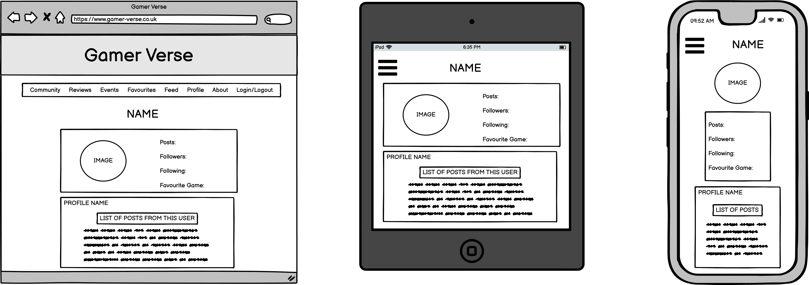

# PP5 - Advanced Frontend  - Gamer Verse

## Introduction
Gamer Verse is a content sharing platform to share reviews, posts and have social interactions with likeminded individuals about games. Users will be able to find posts and reviews relating to the gaming space, along with community events in local cities. This is the frontend section of the project built to work in conjuction with the backend DRF API as the database.

DEPLOYED FRONTEND (HEROKU) - CLICK HERE
DEPLOYED API (HEROKU) - [CLICK HERE](https://gamer-verse-drf-api.herokuapp.com/)
DEPLOYED BACKEND REPOSITORY - [CLICK HERE](https://github.com/Jbachtiger/ci-pp5-gamer-verse-drf-api)

## Live Site
[Click here to view live site]()

## Table of Contents
- [User Experience (UX)](#user-experience)
    - [Site Purpose](#site-purpose)
    - [Site Goals](#site-goals)
    - [Epics](#epics)
    - [User Stories](#user-stories)
- [Design](#design)
    - [Wireframes](#wireframes)
    - [Colour Scheme](#color-scheme)
    - [Fonts](#fonts)
- [Agile](#agile)
- [Database Schema](#database-schema)
- [Features](#features)
- [Future Development](#future-development)
- [Testing](#testing)
    - [Manual Testing](#manual-testing)
    - [Automated Testing](#automated-testing)
    - [Browser and Device Testing](#browser-and-device-testing)
    - [W3C Validator](#w3c-validatior)
    - [JS Lint](#js-lint)
    - [PEP8 Linter Results](#pep8-linter-results)
    - [Colour Contrast Checks](#colour-contrast-checks)
    - [Lighthouse Tool](#lighthouse-tool)
- [Solved Bugs](#solved-bugs)
- [Known Bugs](#known-bugs)
- [Technologies Used](#technologies-used)
    - [Languages Used](#languages-used)
    - [Frameworks, Libraries and Programs](#frameworks-libraries-and-programs)
    - [Databases](#databases)
- [Deployment](#deployment)
    - [Deploying to Heroku](#deploying-to-heroku)
    - [Forking Repository](#forking-repository)
    - [Cloning Repository](#cloning-repository)
- [Credits](#credits)
    - [Code](#code)
    - [Content](#content)
    - [Media](#media)
    - [Resources](#resources)
    - [Acknowledgements](#acknowledgements)

## User Experience
### Site Purpose
To be the go-to gaming community by sharing latest news, reviews, and interesting gaming trivia that users can then comment on and have friendly discussion to share their passion. 

### Site Goals
- To provide users with the latest news, reviews, and trivia about gaming
- To bring people together and create a sense of belonging
- To share with the community and create interesting discussions
- To share local events with each other

__Sites Ideal Users__
- An interest in gaming no matter what medium
- Looking for a gaming community to reach out and connect with like-minded individuals

### Epics
8 Epics were created which were further developed into 32 User Stories. The details of each epic along with the associated user stories can be found in the kanban board [here](https://github.com/users/Jbachtiger/projects/3). 

1. Initial Django REST and React Setup [#1](https://github.com/Jbachtiger/ci-pp5-gamer-verse/issues/1)
2. Authentication [#2](https://github.com/Jbachtiger/ci-pp5-gamer-verse/issues/2)
3. Navigation [#3](https://github.com/Jbachtiger/ci-pp5-gamer-verse/issues/3)
4. Posts [#4](https://github.com/Jbachtiger/ci-pp5-gamer-verse/issues/4)
5. Comments [#5](https://github.com/Jbachtiger/ci-pp5-gamer-verse/issues/5)
6. Profiles [#6](https://github.com/Jbachtiger/ci-pp5-gamer-verse/issues/6)
7. Events [#7](https://github.com/Jbachtiger/ci-pp5-gamer-verse/issues/7)
8. Reviews [#38](https://github.com/Jbachtiger/ci-pp5-gamer-verse/issues/38)

### User Stories 
Below are links to each of the individual user stories that were completed within the project's initial release.

1. Initial Django Setup
    - Install Django and supporting libraries [#2](https://github.com/Jbachtiger/ci-pp4-the-unconventional-programmer/issues/2)
    - Keep secret keys secure [#3](https://github.com/Jbachtiger/ci-pp4-the-unconventional-programmer/issues/3)
    - Early deployment of the site to Heroku [#4](https://github.com/Jbachtiger/ci-pp4-the-unconventional-programmer/issues/4)

## Design
### Wireframes
- About

- Events

- Forms

- Homepage

- Profile

### Color Scheme

### Fonts

## Agile

## Database Schema

## Features

## Future Development

## Testing

### Manual Testing
I have manually tested all the features of the website making sure to go through them with different browsers and device sizes. I have also checked the features of the site against the original user stories to ensure they have all been actioned. 

__User Stories__

__Features__

### Automated Testing

### Browser and Device Testing

__Browsers__

- The website was tested on the following browsers: Google Chrome, Firefox, Microsoft Edge and Safari
- For each browser, functionality was tested including links and the responsive design

__Devices Tested__

The website was viewed on a variety of devices of all sizes including:
- Windows 11 Desktop (screen resolutions tested in 2560x1080 and 1920x1080)
- MacBook Pro (13-inch 2015 version)
- Moto G4
- Galaxy S5
- Pixel 2
- Pixel 2 XL
- iPhone 5/SE
- iPhone 6/7/8
- iPhone 6/7/8 Plus
- iPhone X
- iPad
- iPad Pro
- Surface Duo

### W3C Validatior
The official W3C Markup Validator was used to validate both the HTML and CSS of the project to ensure there were no syntax errors within the site. 

__W3C HTML Markup Validator__

__W3C CSS Markup Validatior__ - https://jigsaw.w3.org/css-validator/validator

### JS Lint

### Colour Contrast Checks

### Lighthouse Tool

## Solved Bugs

## Known Bugs

## Technologies Used
### Languages Used

### Frameworks, Libraries and Programs
 
### Databases
- SQLite: local database used to test during development
- PostgreSQL: database used in Heroku to store data on deployment

## Deployment
### Deploying to Heroku

### Forking Repository
You can fork the GitHub repository to make a copy of the original to view and change without affecting the original. This can be done by:

1. Log into GitHub or create an account
2. Locate the repository at https://github.com/Jbachtiger/ci-pp5-gamer-verse
3. At the top of the repository, on the right-hand side of the page you will see an option to select "Fork" from the available buttons
4.  Click the fork button and a copy of the repository will have been created

### Cloning Repository
You can create a clone of your repository by:

1. Locate the repository you wish to clone https://github.com/Jbachtiger/ci-pp5-gamer-verse
2. Click the arrow on the 'Code' button at the top of the list of files
3. Select the clone by https and copy the URL using the provided clipboard
4. Navigate to your chosen code editor and within the terminal change the directory to the location your to clone the repository to
5. Type 'git clone' and paste the https link you copied from GitHub
6. Press enter and git will clone the repository to your local machine

## Credits
### Code

### Content 

### Media

### Resources

### Acknowledgements
